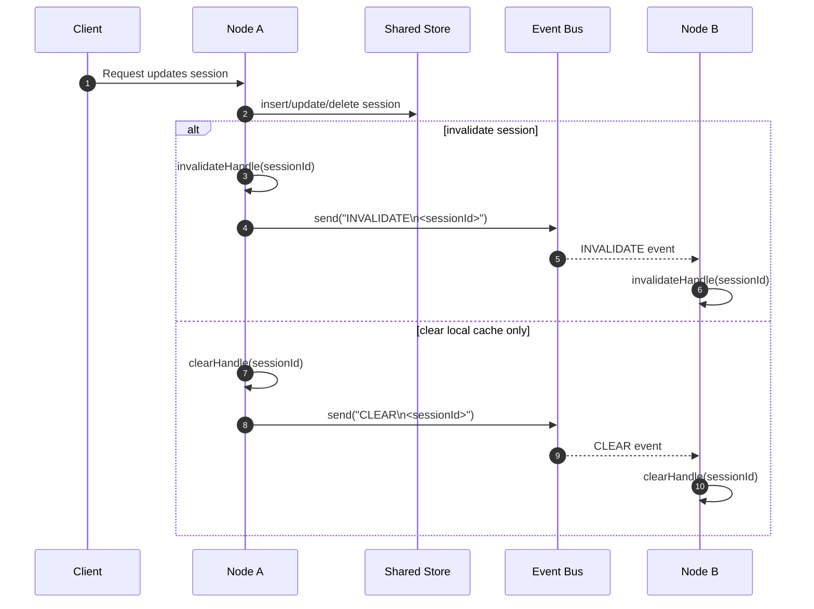

# Sync Session

Sync Session is a Spring Boot library for shared session management in distributed systems.
It stores session state in a shared store and uses an event bus to keep each node's local cache converged.
It is designed for microservice architectures where a request may pass through multiple services, and each service needs to validate the session independently without sacrificing security or performance.
The request's authenticated identity remains verifiable throughout the entire service chain: every service validates the session as user-originated context instead of trusting an internal service-to-service protocol or a caller-supplied user ID.

Languages: English | Traditional Chinese: `README.zh-TW.md`

## What This Library Solves

Use Sync Session when you want:

- one session shared by multiple Spring Boot services
- each microservice to verify sessions locally while serving the same request flow
- server-side session invalidation across nodes
- centralized session security with local-cache performance
- preserve user authentication across service boundaries, so APIs execute on behalf of a validated user rather than an arbitrary `userId` parameter
- cookie or header based session id transport
- a simple RDBMS-backed session store without Spring Session

## User-originated Request Validation

In a microservice request flow, authentication must remain verifiable even when the request crosses service boundaries. Each service validates the session before processing the request and derives the current user from that validated session.

This prevents an internal service-to-service protocol from becoming an implicit authentication mechanism. It also prevents an API from performing a user-specific action merely because the caller supplied a `userId`. Request parameters may identify a target resource, but the caller's identity must come from the validated session.

## Requirements

- Java 17+
- Spring Boot 3+
- Database: MySQL, H2, or PostgreSQL

## Add Dependency

```xml
<dependency>
  <groupId>io.github.babyblue94520</groupId>
  <artifactId>sync-session</artifactId>
  <version>3.0.0-RELEASE</version>
</dependency>
```

UUIDv7 generation uses `uuid-creator` internally.

## Quick Start

### 1. Enable Sync Session

```java
@EnableSyncSession
@Configuration
public class SessionConfig {
}
```

### 2. Configure the library

```yaml
sync-session:
  name: SSESSIONID
  mode: Cookie
  store: DataSource
  timeout: 30m
  clazz: com.example.session.TokenSession
  ds:
    table-name: session
```

### 3. Read or create a session in a request

```java
SyncSessionRequestContext<SyncSession> sessionContext = SyncSessionRequestContextHolder.get();
SyncSession session = sessionContext.getSession(true);
```

### 4. Update fields on a custom session class

```java
public class TokenSession extends SyncSession {
    private String csrfToken;

    public void setCsrfToken(String csrfToken) {
        this.csrfToken = csrfToken;
        this.setAsChanged();
    }
}
```

Register the custom session class in configuration:

```yaml
sync-session:
  clazz: com.example.session.TokenSession
```

```java
SyncSessionRequestContext<TokenSession> sessionContext = SyncSessionRequestContextHolder.get();
TokenSession session = sessionContext.getSession(true);
session.setUsername("clare");
session.setCsrfToken("token");
```

### 5. Invalidate a session

```java
session.invalidate();
```

## Common Usage

### Session id transport

Sync Session supports two transport modes:

- `Cookie` (default): `Set-Cookie: SSESSIONID=...`
- `Header`: request/response header `SSESSIONID`

Example:

```yaml
sync-session:
  mode: Header
```

### Store type

Two store types are available:

- `DataSource` (default): recommended for distributed systems
- `Local`: local file persistence for single-node or demo use

Example:

```yaml
sync-session:
  store: Local
  local:
    path: temp
    file-name: session.ser
```

### Invalidate by username

Invalidate all sessions for a user:

```java
syncSessionService.invalidateByUsername(username);
```

Or exclude specific session ids:

```java
syncSessionService.invalidateByUsername(username, excludeSessionId1, excludeSessionId2);
```

## Distributed Deployment

For multi-node deployments, provide a `SyncSessionEventService` implementation.
This is the bridge between the shared session store and each node's local in-memory cache.

```java
@Log4j2
@Service
@RequiredArgsConstructor
public class NatsSyncSessionEventService implements SyncSessionEventService, InitializingBean {
    private final Connection natsConnection;
    
    private final List<Consumer<String>> messageListeners = new CopyOnWriteArrayList<>();
    
    @Override
    public void afterPropertiesSet() throws Exception {
      dispatcher = natsConnection.createDispatcher(this::onMessage);
    }

    private void onMessage(Message message) {
      String payload = new String(message.getData());
      for (Consumer<String> listener : listeners) {
        try {
          listener.accept(payload);
        } catch (Exception e) {
          log.error(e.getMessage(), e);
        }
      }
    }
    
    @Override
    public void send(String body) {
        // publish body to NATS subject
      NatsMessage msg = NatsMessage.builder()
              .subject(topic)
              .data(body)
              .build();
      natsConnection.publish(msg);
    }

    @Override
    public void addListener(Consumer<String> listener) {
        // subscribe once and call listener.accept(body)
      messageListeners.add(listener);
    }

    @Override
    public boolean isAvailable() {
        // check bus health
        return true;
    }
}
```

### Event payloads

Typical payloads are:

- `INVALIDATE\n<sessionId>`
- `CLEAR\n<sessionId>`

### Multi-node event flow



### Expected behavior

Your `SyncSessionEventService` implementation should:

- publish raw event bodies to a shared topic, subject, or channel
- subscribe once and forward every message back to Sync Session
- return `false` from `isAvailable()` when the bus is unhealthy
- avoid silently dropping messages

### If the event bus is unavailable

When `isAvailable()` returns `false`:

- local cache is not trusted for reads
- `find(id)` reads directly from the shared store
- correctness is preferred over cache speed

## Configuration Reference

```yaml
sync-session:
  name: SSESSIONID
  mode: Cookie
  store: DataSource
  timeout: 30m
  batch-job-delay: 1m
  max-retry-insert: 5
  ds:
    bean-name:
    table-name: session
    update-batch-size: 100
  local:
    persistence: false
    path: temp
    file-name: session.ser
```

### Main properties

- `sync-session.name`: session id key used by cookie/header
- `sync-session.mode`: `Cookie` or `Header`
- `sync-session.store`: `DataSource` or `Local`
- `sync-session.timeout`: session timeout
- `sync-session.clazz`: custom session class, must extend `SyncSession`
- `sync-session.batch-job-delay`: background cleanup/update interval
- `sync-session.max-retry-insert`: retry count when generated session id collides

### `ds` properties

- `bean-name`: choose a specific `DataSource` bean
- `table-name`: session table name
- `update-batch-size`: batch size for last-access-time updates

### `local` properties

- `persistence`: persist sessions to local file on shutdown
- `path`: persistence directory
- `file-name`: persistence file name

## Session Model Notes

- session id uses UUIDv7 for better index locality
- session attributes are stored from your custom `SyncSession` subclass
- configure the subclass with `sync-session.clazz`
- if you add custom setters, call `setAsChanged()` when the session content changes

## Schema

When using `DataSource` store, Sync Session initializes the table from the SQL scripts under `src/main/resources/schema`
using the configured `ds.table-name`.

## Stress Test Reference

The following results are reference measurements from the database-specific `SessionCreateStress*Test` classes.
It is useful for rough capacity planning, but it should not be treated as a guaranteed production baseline.

### Environment

- Database: MySQL 8 / PostgreSQL
- CPU: `Intel(R) Core(TM) i7-6700 CPU @ 3.40GHz`
- Memory max capacity: `32 GB`
- Memory type: `DDR4`
- Memory type detail: `Synchronous`
- Memory speed: `2133 MT/s`

### Test input

- Threads: `100`
- Target sessions: `1,000,000`
- Cache access operations: `100,000,000`; database access operations: `1,000,000`

### Final result

The measurements below use `100,000,000` cache-hit operations and `1,000,000` database-read operations.

MySQL:

```text
session stress completed: threads=100, targetSessions=1000000, create[success=1000000, failure=0, elapsed=64377ms, rps=15533.34, latencyMs[min=1.973, mid=5.958, max=77.117]], cacheHit[success=100000000, failure=0, elapsed=4996ms, rps=20012963.60, latencyMs[min=0.000, mid=0.000, max=61.160]], databaseFind[success=1000000, failure=0, elapsed=14434ms, rps=69278.47, latencyMs[min=0.178, mid=1.146, max=31.402]], jvmSessions[count=1000000, heapDelta=392.39MB (0.3832GB)], tableRows[count=4237289, added=1000000]
```

PostgreSQL:

```text
session stress completed: threads=100, targetSessions=1000000, create[success=1000000, failure=0, elapsed=32892ms, rps=30402.01, latencyMs[min=0.446, mid=2.645, max=235.973]], cacheHit[success=100000000, failure=0, elapsed=4702ms, rps=21267488.28, latencyMs[min=0.000, mid=0.002, max=40.837]], databaseFind[success=1000000, failure=0, elapsed=11278ms, rps=88662.54, latencyMs[min=0.179, mid=0.903, max=35.572]], jvmSessions[count=1000000, heapDelta=382.39MB (0.3734GB)], tableRows[count=7270040, added=1000000]
```

### How to read the numbers

- `threads`: worker threads used by the stress test
- `targetSessions`: total number of sessions the test tries to create
- `create`: session creation phase, including store insert and local cache retention
- `cacheHit`: `100,000,000` access operations that hit the local session cache
- `databaseFind`: `1,000,000` access operations that bypass local cache and query the store
- `success`: operations completed successfully in each phase
- `failure`: failed operations in each phase
- `elapsed`: phase wall-clock time
- `rps`: average completed operations per second for the phase
- `latencyMs.min`: fastest observed operation latency
- `latencyMs.mid`: representative middle latency after trimming the lowest `10%` and highest `10%` samples
- `latencyMs.max`: slowest observed operation latency
- `jvmSessions.count`: local in-memory session count held by the JVM after the run
- `jvmSessions.heapDelta`: observed JVM heap growth before vs. after the stress run
- `tableRows.count`: total rows in the session table after the run
- `tableRows.added`: rows inserted by this stress run

### What this result means

- both runs created `1,000,000` sessions successfully with no failures
- MySQL created sessions in about `64.4` seconds at around `15,533 sessions/sec`
- PostgreSQL created sessions in about `32.9` seconds at around `30,402 sessions/sec`
- local cache completed `100,000,000` reads in `4.996` seconds on MySQL and `4.702` seconds on PostgreSQL
- local cache throughput reached about `20,012,964 ops/sec` on MySQL and `21,267,488 ops/sec` on PostgreSQL
- compared with forced database reads, the local cache reached about `289x` the MySQL throughput and `240x` the PostgreSQL throughput
- forced database reads completed at around `69,278 ops/sec` on MySQL and `88,663 ops/sec` on PostgreSQL
- the JVM retained about `1,000,000` local sessions after each run, with observed heap growth around `392.39 MB` on MySQL and `382.39 MB` on PostgreSQL
- `tableRows.added=1000000` confirms that each run inserted the expected number of rows
- based on this run, the retained in-memory session footprint was relatively modest compared with the total session count, but actual production memory usage still depends on your custom session fields, GC behavior, and surrounding application load

### Notes

- `mid` removes the lowest `10%` and highest `10%` latency samples, then takes the middle value from the remaining range
- `heapDelta` is the observed JVM heap increase before and after the stress run
- `tableRows.count` may include rows created before the current run; use `tableRows.added` to validate this run's insert count
- latency samples are capped at `1,000,000` per phase to avoid allocating hundreds of megabytes for a `100,000,000`-operation cache run; throughput counters still include every operation
