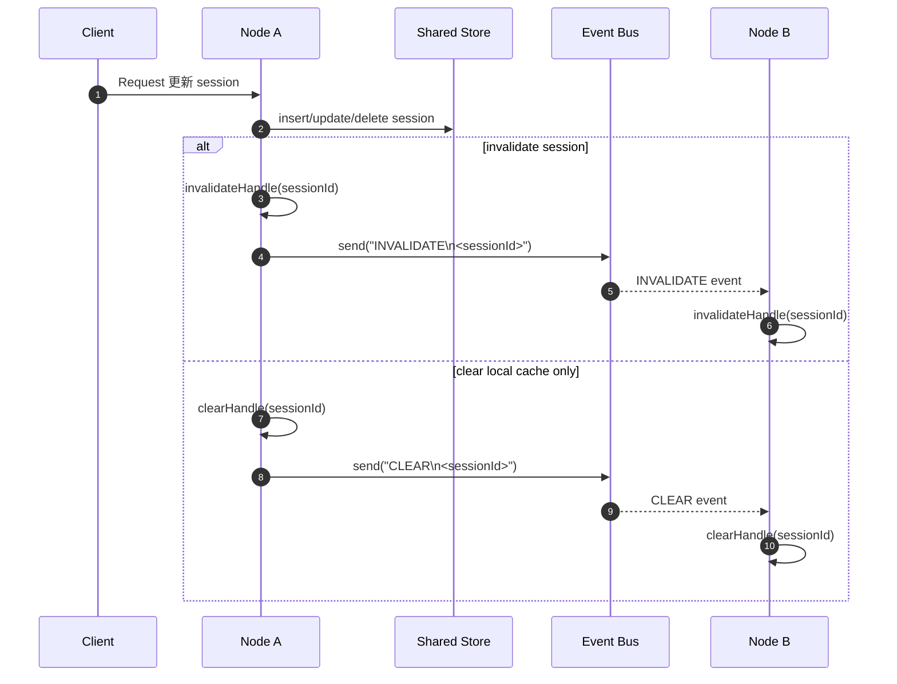

# Sync Session（繁體中文）

Sync Session 是一個給 Spring Boot 使用的共享 Session 管理解決方案，適合多節點或分散式系統。
它會把 Session 狀態存到共享儲存，並透過事件匯流排讓各節點的本地快取維持一致。
這個函式庫主要用在微服務架構下：當同一個請求需要跨多個服務流轉時，每個服務都能各自驗證 Session，在維持安全性的同時避免犧牲效能。
請求在跨服務流轉的整個過程中，都應該保留可驗證的使用者身分：每個服務都驗證這份 Session，確認請求帶有已登入使用者的身分，而不是把服務之間的協議當成身分驗證，也不信任呼叫端直接傳入的 `userId`。

英文版請見 `README.md`。

## 這個函式庫解決什麼問題

適合以下情境：

- 多個 Spring Boot 服務需要共用同一份 Session
- 同一個請求會跨多個微服務，且每個服務都需要自行驗證 Session
- 需要跨節點使 Session 失效
- 希望保留集中式 Session 安全性，同時取得本地快取的效能
- 讓 API 根據已驗證的使用者身分執行操作，避免只因傳入任意 `userId` 就代替使用者執行任務
- 需要支援 Cookie 或 Header 傳遞 SessionId
- 想用簡單的 RDBMS session store，而不是導入 Spring Session

## 驗證使用者發起的請求

在微服務的請求流程中，即使請求跨越多個服務，驗證資訊也不應該在服務邊界中斷。每個服務都應先驗證 Session，再從已驗證的 Session 取得目前使用者，之後才處理請求與授權。

如此可以避免把服務之間的內部協議當成使用者身分驗證，也避免 API 僅因呼叫端提供了 `userId`，就直接代替該使用者執行操作。請求參數可以用來指定目標資源，但呼叫者身分必須來自已驗證的 Session。

## 需求

- Java 17+
- Spring Boot 3+
- Database：MySQL / H2 / PostgreSQL

## 加入依賴

```xml
<dependency>
  <groupId>io.github.babyblue94520</groupId>
  <artifactId>sync-session</artifactId>
  <version>2.1.0-SNAPSHOT</version>
</dependency>
```

UUIDv7 由 `uuid-creator` 產生。

## 快速開始

### 1. 啟用 Sync Session

```java
@EnableSyncSession
@Configuration
public class SessionConfig {
}
```

### 2. 設定基本參數

```yaml
sync-session:
  name: SSESSIONID
  mode: Cookie
  store: DataSource
  timeout: 30m
  clazz: com.example.session.TokenSession
  ds:
    table-name: session
```

### 3. 在 request 中取得或建立 Session

```java
SyncSessionRequestContext<SyncSession> sessionContext = SyncSessionRequestContextHolder.get();
SyncSession session = sessionContext.getSession(true);
```

### 4. 使用自訂 Session 類別

```java
public class TokenSession extends SyncSession {
    private String csrfToken;

    public void setCsrfToken(String csrfToken) {
        this.csrfToken = csrfToken;
        this.setAsChanged();
    }
}
```

並在設定中註冊這個自訂 class：

```yaml
sync-session:
  clazz: com.example.session.TokenSession
```

```java
SyncSessionRequestContext<TokenSession> sessionContext = SyncSessionRequestContextHolder.get();
TokenSession session = sessionContext.getSession(true);
session.setUsername("clare");
session.setCsrfToken("token");
```

### 5. 使目前 Session 失效

```java
session.invalidate();
```

## 常見使用方式

### SessionId 傳遞模式

支援兩種模式：

- `Cookie`（預設）
- `Header`

範例：

```yaml
sync-session:
  mode: Header
```

### 儲存方式

支援兩種 store：

- `DataSource`（預設）：適合分散式系統
- `Local`：適合單機、開發或 demo

範例：

```yaml
sync-session:
  store: Local
  local:
    path: temp
    file-name: session.ser
```

### 依 username 使 Session 失效

讓某位使用者的所有 Session 失效：

```java
syncSessionService.invalidateByUsername(username);
```

排除特定 Session：

```java
syncSessionService.invalidateByUsername(username, excludeSessionId1, excludeSessionId2);
```

## 分散式部署

若是多節點部署，請提供 `SyncSessionEventService` 的實作。
它負責在共享 Session Store 與各節點本地快取之間同步事件。

```java
@Log4j2
@Service
@RequiredArgsConstructor
public class NatsSyncSessionEventService implements SyncSessionEventService, InitializingBean {
    private final Connection natsConnection;
    
    private final List<Consumer<String>> messageListeners = new CopyOnWriteArrayList<>();
    
    @Override
    public void afterPropertiesSet() throws Exception {
      dispatcher = natsConnection.createDispatcher(this::onMessage);
    }

    private void onMessage(Message message) {
      String payload = new String(message.getData());
      for (Consumer<String> listener : listeners) {
        try {
          listener.accept(payload);
        } catch (Exception e) {
          log.error(e.getMessage(), e);
        }
      }
    }
    
    @Override
    public void send(String body) {
        // publish body to NATS subject
      NatsMessage msg = NatsMessage.builder()
              .subject(topic)
              .data(body)
              .build();
      natsConnection.publish(msg);
    }

    @Override
    public void addListener(Consumer<String> listener) {
        // subscribe once and call listener.accept(body)
      messageListeners.add(listener);
    }

    @Override
    public boolean isAvailable() {
        // check bus health
        return true;
    }
}
```

### Event payload

常見 payload：

- `INVALIDATE\n<sessionId>`
- `CLEAR\n<sessionId>`

### Multi-node event flow



### 實作期待

你的 `SyncSessionEventService` 最好符合以下行為：

- 把原始 event body 發送到共享 topic、subject 或 channel
- 只訂閱一次，並把每筆訊息轉回 Sync Session
- 當 event bus 不健康時，`isAvailable()` 回傳 `false`
- 不要靜默丟失訊息

### Event bus 不可用時

當 `isAvailable()` 回傳 `false`：

- 本地快取不再被信任用於讀取
- `find(id)` 會直接查共享 store
- 系統優先保證正確性，而不是快取速度

## 設定參考

```yaml
sync-session:
  name: SSESSIONID
  mode: Cookie
  store: DataSource
  timeout: 30m
  batch-job-delay: 1m
  max-retry-insert: 5
  ds:
    bean-name:
    table-name: session
    update-batch-size: 100
  local:
    persistence: false
    path: temp
    file-name: session.ser
```

### 主要參數

- `sync-session.name`：cookie/header 使用的 session key
- `sync-session.mode`：`Cookie` 或 `Header`
- `sync-session.store`：`DataSource` 或 `Local`
- `sync-session.timeout`：session timeout
- `sync-session.clazz`：自訂 session class，必須繼承 `SyncSession`
- `sync-session.batch-job-delay`：背景清理與更新週期
- `sync-session.max-retry-insert`：session id 衝突時的重試次數

### `ds` 參數

- `bean-name`：指定特定 `DataSource` bean
- `table-name`：session table 名稱
- `update-batch-size`：批次更新 last access time 的大小

### `local` 參數

- `persistence`：關閉時是否寫回本地檔案
- `path`：持久化目錄
- `file-name`：持久化檔名

## Session 模型注意事項

- session id 使用 UUIDv7，較有利於索引區域性
- 自訂欄位會存放在你的 `SyncSession` 子類別中
- 需透過 `sync-session.clazz` 指定自訂子類別
- 如果自訂 setter 會改變 session 內容，記得呼叫 `setAsChanged()`

## Schema

使用 `DataSource` store 時，會依 `src/main/resources/schema` 下的 SQL 與 `ds.table-name` 自動初始化資料表。

## 壓力測試參考

以下結果來自各資料庫專用的 `SessionCreateStress*Test` 子類別，可作為粗略容量規劃參考，但不應直接視為正式環境保證值。

### 測試環境

- Database: `MySQL 8` / `PostgreSQL`
- CPU: `Intel(R) Core(TM) i7-6700 CPU @ 3.40GHz`
- 記憶體最大容量：`32 GB`
- 記憶體類型：`DDR4`
- 記憶體細節：`Synchronous`
- 記憶體速度：`2133 MT/s`

### 測試輸入

- Threads: `100`
- Target sessions: `1,000,000`
- Cache 訪問次數：`100,000,000` 次；資料庫訪問次數：`1,000,000` 次

### 最終結果

以下數據是 cache 訪問 `100,000,000` 次、資料庫訪問 `1,000,000` 次的結果。

MySQL：

```text
session stress completed: threads=100, targetSessions=1000000, create[success=1000000, failure=0, elapsed=64377ms, rps=15533.34, latencyMs[min=1.973, mid=5.958, max=77.117]], cacheHit[success=100000000, failure=0, elapsed=4996ms, rps=20012963.60, latencyMs[min=0.000, mid=0.000, max=61.160]], databaseFind[success=1000000, failure=0, elapsed=14434ms, rps=69278.47, latencyMs[min=0.178, mid=1.146, max=31.402]], jvmSessions[count=1000000, heapDelta=392.39MB (0.3832GB)], tableRows[count=4237289, added=1000000]
```

PostgreSQL：

```text
session stress completed: threads=100, targetSessions=1000000, create[success=1000000, failure=0, elapsed=32892ms, rps=30402.01, latencyMs[min=0.446, mid=2.645, max=235.973]], cacheHit[success=100000000, failure=0, elapsed=4702ms, rps=21267488.28, latencyMs[min=0.000, mid=0.002, max=40.837]], databaseFind[success=1000000, failure=0, elapsed=11278ms, rps=88662.54, latencyMs[min=0.179, mid=0.903, max=35.572]], jvmSessions[count=1000000, heapDelta=382.39MB (0.3734GB)], tableRows[count=7270040, added=1000000]
```

### 如何閱讀這些數字

- `threads`：壓力測試使用的工作執行緒數量
- `targetSessions`：測試預計建立的 session 總數
- `create`：session 建立階段，包含寫入 store 與保留本地 cache
- `cacheHit`：`100,000,000` 次命中本地 session cache 的訪問
- `databaseFind`：`1,000,000` 次強制略過本地 cache、查詢 store 的訪問
- `success`：各階段成功完成的操作數
- `failure`：各階段失敗的操作數
- `elapsed`：各階段花費的時間
- `rps`：各階段平均每秒完成的操作數
- `latencyMs.min`：觀測到的最小操作延遲
- `latencyMs.mid`：去掉前 `10%` 與後 `10%` 極端值後，再取中間值的代表性延遲
- `latencyMs.max`：觀測到的最大操作延遲
- `jvmSessions.count`：測試結束後 JVM 本地記憶體中持有的 session 數量
- `jvmSessions.heapDelta`：壓測前後 JVM heap 觀測到的成長量
- `tableRows.count`：測試結束後 session table 的總筆數
- `tableRows.added`：本次壓測新增的資料筆數

### 這組結果代表什麼

- 兩組測試都成功建立 `1,000,000` 個 session，且沒有失敗
- MySQL 約在 `64.4` 秒內完成 session 建立，吞吐約 `15,533 sessions/sec`
- PostgreSQL 約在 `32.9` 秒內完成 session 建立，吞吐約 `30,402 sessions/sec`
- 本地 cache 完成 `100,000,000` 次訪問，MySQL 需 `4.996` 秒，PostgreSQL 需 `4.702` 秒
- 本地 cache 吞吐達到 MySQL 約 `20,012,964 ops/sec`、PostgreSQL 約 `21,267,488 ops/sec`
- 與強制查詢資料庫相比，本地 cache 的吞吐約為 MySQL 的 `289` 倍、PostgreSQL 的 `240` 倍
- 強制查詢資料庫的吞吐則為 MySQL 約 `69,278 ops/sec`、PostgreSQL 約 `88,663 ops/sec`
- 壓測完成後 JVM 本地都保留約 `1,000,000` 個 session，觀測到 heap 成長 MySQL 約 `392.39 MB`、PostgreSQL 約 `382.39 MB`
- `tableRows.added=1000000` 確認兩組測試都新增了預期的資料筆數
- 這次測試顯示 session 本地保留的記憶體占用相對可控，但正式環境的實際記憶體使用仍會受自訂欄位、GC 行為與其他應用負載影響

### 備註

- `mid` 的計算方式是先移除最小 `10%` 與最大 `10%` 延遲樣本，再從剩餘範圍取中間值
- `heapDelta` 是壓測前後觀測到的 JVM heap 增量
- `tableRows.count` 可能包含本次測試前已存在的資料；請以 `tableRows.added` 驗證本次新增筆數
- 為避免 `100,000,000` 次 cache 壓測配置數百 MB 的 latency 陣列，每階段最多取樣 `1,000,000` 筆 latency；吞吐計數仍包含全部操作
